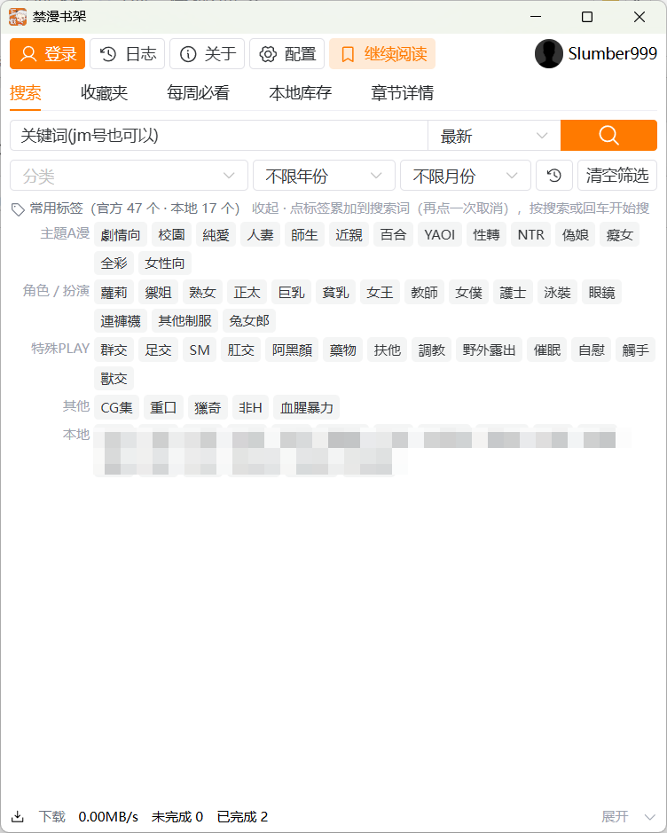
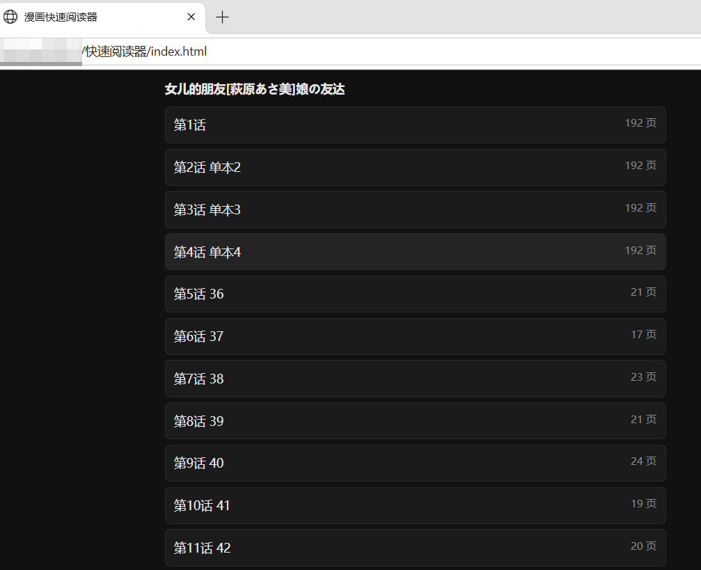

<p align="center">
  
</p>

<h1 align="center">📚 禁漫书架 · JMComic Shelf</h1>

<p align="center">
  禁漫天堂（JMComic / 18comic）桌面客户端：<b>搜索 · 下载 · 本地书库 · 内置阅读器</b>
  <br />
  <sub>Tauri 2 + Vue 3 + Rust</sub>
</p>

> 本项目是 **[lanyeeee/jmcomic-downloader](https://github.com/lanyeeee/jmcomic-downloader) 的二次开发版本（Fork）**。
> 原版是一个很好用的多线程图形界面下载器。
> 加了内置阅读器、本地书库管理、多标签搜索、标签云、线路自动切换等。

## ✨ 功能

### 继承自原版的基础能力
多线程下载 · 章节勾选 · 图片格式（jpg/png）· cbz / pdf 导出 · 收藏夹批量下载 · 更新库存 · 代理设置 · 日志查看

### 本仓库新增

| | |
| --- | --- |
| 🔍 **搜索增强** | 官方分类树、官方常用标签、**多标签累加搜索**（空格分隔，点标签自动追加到搜索词）、年月筛选、搜索历史 |
| ⭐ **收藏夹** | 多选批量下载 / 导出 cbz、一键「同步收藏夹」、长列表点选模式 |
| 📦 **免下载直出 cbz** | 图片在内存里取回、还原拼图后直接打包，不落下载目录，带图片级进度 |
| 📖 **内置阅读器** | 本地图片 / cbz / **未下载漫画在线阅读**；单页与滚动两种模式；上一章 / 下一章；图片级预加载与内存缓存 |
| 🏷️ **本地标签云** | 聚合已下载漫画的标签（纯离线），点标签即可按它搜索，或在本地库存里筛选 |
| 🗂️ **本地库存** | 下载目录 / 导出目录两种来源切换、标签筛选、阅读进度、按体积统计 |
| 🚀 **快速阅读器** | 把选中的漫画导成自包含的 HTML 分享包（图片已内联 / 已解压），可离线看、满足直接分享给任何人的需要 |
| 🌐 **线路优化** | API 线路一键测速并选最快；图片线路失败自动切换 |
| 🧹 **空间统计与清理** | 下载 / 导出 / 日志占用统计，清理下载残留、分享包、旧日志，按体积删除单本漫画 |
| 🖥️ **界面重排** | 全局顶栏 + 底部常驻状态栏 + 可展开的下载/导出进度抽屉 |

## 🖼️ 界面截图

> 点图片可看大图

| **搜索** | **收藏夹** |
| :---: | :---: |
| [](docs/搜索.png) | [](docs/收藏夹.png) |
| 关键词 + 多标签累加，配合官方分类 / 常用标签 / 年月筛选 | 多选后批量下载、批量导出 cbz，或一键同步收藏夹 |

| **下载** | **快速阅读器** |
| :---: | :---: |
| [](docs/下载.png) | [](docs/快速阅读器.png) |
| 章节勾选、下载与进度查看 | 导出的自包含分享包，在浏览器里直接阅读 |

## ⬇️ 下载

到 [**Release 页面**](https://github.com/Slumber999/JMComic-Shelf/releases) 下载。

## 📖 使用方法

#### 🚀 不用登录也能用
1. 在 `搜索` 里输入关键词；也可以用分类 / 官方标签 / 年份筛选。
2. 点进漫画 → `章节详情`
3. 勾选章节 → `下载勾选章节`；或者直接点 `阅读` 在线阅读
4. 下载好的漫画会出现在 `本地库存`：可以按标签筛选、看阅读进度、导出 cbz / pdf、直接接着读

#### ⭐ 使用收藏夹
1. 顶栏 `登录`
2. `收藏夹` 里选择漫画（支持多选、全选、长列表点选、跨页保留）
3. 点 `下载 / 导出cbz` 批量处理，或点标题进入 `章节详情`

#### 📦 导出与分享
- `导出cbz` / `导出pdf`：把已下载的漫画打包成单文件
- `免下载直出 cbz`：没下载过也能直接出 cbz（边下边打包，不占下载目录）
- `配置 → 导出相关 → 导出快速阅读器`：生成自包含 HTML 分享包，发给别人能直接看

## ❓ 常见问题

- **被杀毒软件误报**：Tauri 打包的未签名 exe 被误报很常见。想彻底放心就照下面「如何构建」自己编译，或者把文件丢到 VirusTotal 等多引擎沙箱看一眼，担心安全问题可自行检查源码。
- **封面 / 图片加载不出来**：图片线路可能被墙。本仓库做了多线路自动 fallback，可以在 `配置 → 网络相关 → 线路测速` 看哪条通、并一键选最快的 API 线路。
- **数据都在哪**：见下面「数据目录」。

## 📁 数据目录

Windows 下默认在 `%APPDATA%\com.slumber999.jmcomic-shelf\`：

| 路径 | 内容 |
| --- | --- |
| `config.json` | 配置（下载/导出目录、并发、代理、线路等） |
| `漫画下载\` | 下载目录（每本一个文件夹，含 `元数据.json` 与封面） |
| `漫画导出\` | 导出目录（cbz / pdf / 快速阅读器分享包） |
| `日志\` | 运行日志 |

这些目录都可以在 `配置` 里改。升级本软件不会动你的漫画库。

## 🛠️ 如何构建

前提：[Rust](https://www.rust-lang.org/tools/install)、[Node](https://nodejs.org/en)、[pnpm](https://pnpm.io/installation)

```bash
git clone https://github.com/Slumber999/JMComic-Shelf.git
cd JMComic-Shelf
pnpm install

# 开发模式（改前端热更新）
pnpm tauri dev

# 打包：exe + 安装包
pnpm tauri build

# 只想要免安装 exe，不打安装包（产物在 src-tauri/target/release/）
pnpm build
pnpm tauri build --no-bundle
```

跑测试：

```bash
cd src-tauri
cargo test --lib
```

## 🤝 反馈与贡献

- Bug、功能建议：欢迎开 issue
- PR 欢迎，但**新功能请先开 issue 讨论一下**，避免做完发现方向不对
- 想要上游原版的功能或问题反馈，请去 [原仓库](https://github.com/lanyeeee/jmcomic-downloader)

## ⚠️ 免责声明

- 本工具仅供学习、研究、交流使用，请勿用于商业用途
- 使用者应自行承担使用风险；作者不对使用本工具造成的任何损失、法律纠纷或其他后果负责
- 请遵守你所在地区的法律法规，支持正版

## 📄 许可证与致谢

- [MIT License](./LICENSE)
- 基于 [lanyeeee/jmcomic-downloader](https://github.com/lanyeeee/jmcomic-downloader) 二次开发：原始版权、核心下载逻辑与界面设计归原作者所有
- 本项目新增部分同样以 MIT 协议开源
