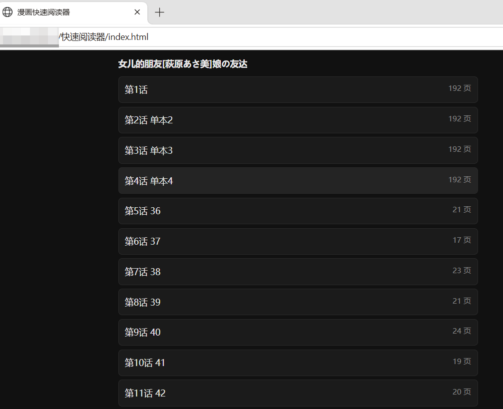

<div align="center">


# 禁漫书架 · JMComic Shelf

禁漫天堂（JMComic / 18comic）桌面客户端
搜索 · 下载 · 任务管理 · 本地书库 · 内置阅读器

</div>

<p align="center">
  <a href="https://github.com/Slumber999/JMComic-Shelf/releases"></a>
  
  
  
  
  
</p>

本项目是 [lanyeeee/jmcomic-downloader](https://github.com/lanyeeee/jmcomic-downloader) 的二次开发版本。上游是一个更好用的、更纯粹的多线程图形界面下载器；本项目在它的基础上补齐了任务管理、内置阅读器、本地书库与整套界面体验，做一个完整、开箱即用的桌面客户端。

## 功能

### 发现与检索

- **搜索**：关键词搜索，支持最新、点击、图片、爱心四种排序
- **搜索增强**：官方分类树、官方常用标签、多标签累加搜索、年月筛选、搜索历史
- **排行榜**：官方总榜 / 月榜 / 周榜 / 日榜，可按全部、同人、单本、短篇、其他、韩漫筛选
- **收藏夹**：登录后浏览收藏夹，多选 / 全选 / 点选 / 跨页保留，批量下载或批量导出 cbz
- **收藏管理**：漫画卡片右下角星标一键收藏，可直接收藏进自建收藏夹；取消收藏会在所有收藏夹生效
- **每周必看**：按官方每周榜单浏览，直接批量下载
- **全站评论**：浏览全站最新评论，点任意一条直接跳转到对应漫画的章节详情页
- **本地库存**：下载目录 / 导出目录两种来源切换，标签筛选、阅读进度、按体积统计与删除
- **本地标签云**：纯离线聚合已下载漫画的标签，点标签即按它搜索，或在本地库存里筛选

### 下载与任务管理

- **多线程下载**：图片并发下载，失败自动重试
- **章节勾选**：在章节详情里勾选任意章节下载，也可以一键下载整本
- **图片格式**：jpg（体积小、速度快）或 png（无损、体积大）
- **暂停 / 继续**：下载与导出任务都能暂停、继续；暂停在图片 / 章节边界生效，不会下载一半
- **任务持久化**：关闭软件时自动全部暂停，重启后在进度抽屉里手动继续
- **进度抽屉**：底部常驻状态栏 + 可展开的下载 / 导出进度面板，支持框选后批量操作

### 导出与分享

- **导出 cbz / pdf**：把已下载的漫画打包成单文件
- **免下载直出 cbz**：图片在内存里取回、还原拼图后直接打包，不落下载目录，带图片级进度
- **跳过已存在**：继续导出时自动跳过已经导好的章节，被打断的那一章从头重来
- **快速阅读器**：导出成自包含的 HTML 分享包（图片已内联），离线可看，方便直接分享给任何人

### 阅读

- **内置阅读器**：本地图片 / cbz / 漫画在线阅读，单页与滚动（条漫）两种模式
- **连续阅读**：上一章 / 下一章、阅读进度记忆、顶栏「继续阅读」一键回到上次位置
- **评论**：在阅读页查看当前漫画的评论
- **预加载与缓存**：图片级预加载 + 内存缓存，翻页不卡

### 界面与配置

- **列表 / 网格视图**：漫画列表可切换列表或网格（4 列大封面，按钮悬停才显示），偏好本地保存
- **封面悬停预览**：列表模式下鼠标放到封面上，侧边贴出放大 2~3 倍的预览图，倍数可在设置里调节
- **线路优化**：API 线路一键测速并选最快；图片线路失败自动切换
- **空间统计与清理**：统计下载 / 导出 / 日志占用，清理下载残留、分享包、旧日志
- **配置分区**：下载、导出、网络、空间、界面

## 界面截图

| **搜索** | **收藏夹** |
| :---: | :---: |
| [](docs/搜索.png) | [](docs/收藏夹.png) |
| 关键词 + 多标签累加，配合官方分类 / 常用标签 / 年月筛选 | 多选后批量下载、批量导出 cbz，或一键同步收藏夹 |

| **排行榜** | **全站评论** |
| :---: | :---: |
| [](docs/排行榜.png) | [](docs/全站评论.png) |
| 官方日榜 / 周榜 / 月榜 / 总榜，可按 全部 / 同人 / 单本 / 短篇 / 其他 / 韩漫 筛选 | 全站最新评论，点任意一条直接跳到对应漫画的章节详情页 |

| **下载** | **快速阅读器** |
| :---: | :---: |
| [](docs/下载.png) | [](docs/快速阅读器.png) |
| 章节勾选、下载与进度查看 | 导出的自包含分享包，在浏览器里直接阅读 |

## 下载

前往 [Releases](https://github.com/Slumber999/JMComic-Shelf/releases) 下载 Windows 免安装单文件 exe，双击即可运行。需要系统自带 WebView2，Windows 10 / 11 一般都有。

## 构建

需要 [Rust](https://www.rust-lang.org/tools/install)、[Node](https://nodejs.org/en)、[pnpm](https://pnpm.io/installation)。

```bash
git clone https://github.com/Slumber999/JMComic-Shelf.git
cd JMComic-Shelf
pnpm install

# 开发模式（改前端热更新）
pnpm tauri dev

# 打包：exe + NSIS 安装包
pnpm tauri build --bundles nsis

# 只想要免安装 exe，不打安装包（产物在 src-tauri/target/release/）
pnpm build
pnpm tauri build --no-bundle
```

## 反馈与贡献

- Bug、功能建议：欢迎开 issue
- 想要上游原版的功能或问题反馈，请去 [原仓库](https://github.com/lanyeeee/jmcomic-downloader)

## 免责声明

- 本工具仅供学习、研究、交流使用，请勿用于商业用途
- 使用者应自行承担使用风险；作者不对使用本工具造成的任何损失、法律纠纷或其他后果负责
- 请遵守你所在地区的法律法规，支持正版

## Star History

[](https://star-history.com/#Slumber999/JMComic-Shelf&Date)

## 许可证与致谢

- [MIT License](./LICENSE)
- 基于 [lanyeeee/jmcomic-downloader](https://github.com/lanyeeee/jmcomic-downloader) 二次开发：原始版权、核心下载逻辑与界面设计归原作者所有
- 本项目新增部分同样以 MIT 协议开源
